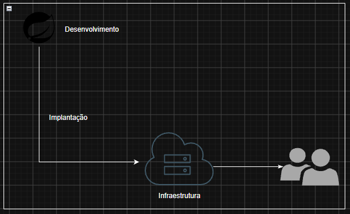
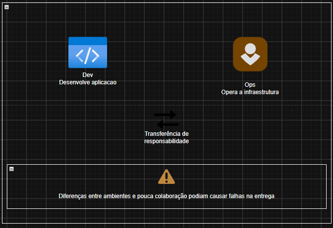
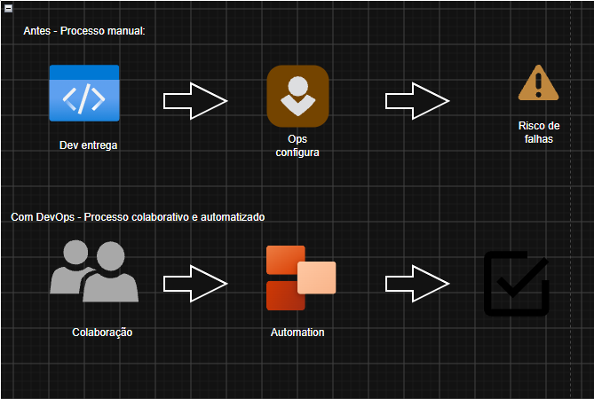

## Aula 1 - Por que Terraform?

1. O software precisa ser entregue:
Um software não esta concluido simplesmente porque funciona no computador do desenvolvedor. Ele precisa estar disponivel para os usuarios

Agora, imagina voce que desenvolveu um projeto que possue API Java com Spring Boot, e ela compila, passa nos testes e funciona perfeitamente no seu notebook

E a pergunta: será que isso significa que a aplicação está pronta para ser utilizada por milhares de usuários?

Não necessariamente, pois para disponibilizar, precisa considerar a infraestrutura responsavel por executar a aplicacao, garantir disponibilidade, lidar com aumentos de trafego e proteger o sistema

Ou seja, isso seria o Software Delivery!

2. A separacao entre Dev e Ops

Antigamente, as empresas costumavam dividir o desenvolvimento e a operacao dos sistemas em duas equipes:

> Dev era responsavel por desenvolver o software, escrever codigo e implementar funcionalidades

> Ops era responsavel por preparar servidores, configurar ambientes e manter as aplicacoes funcionando

E qual era o problema disso? 
A separacao entre equipes dificultava a entrega de software, causando incosistencias, falhas e atrasos na implantacao

3. O surgimento do DevOps

Como as empresas cresceram, e essas separacao causava dificuldades, ocorrendo implantacoes lentas, configuracoes inconsistentes e falhas frequentes. 
O movimento DevOps surgiu para aproximar a responsabilidades e tornar a entrega de software mais eficiente!

Lembrando: DevOps nao e linguagem de programacao, ou cargo especifico, ele e um conjunto de práticas, processos e princípios voltados à colaboração e à melhoria da entrega de software
> Yevgeniy Brikman resume seu objetivo como tornar a entrega de software muito mais eficiente

4. O que muda com DevOps?

Agora imagina uma empresa que precisa publicar uma nova versao de uma API Java:

